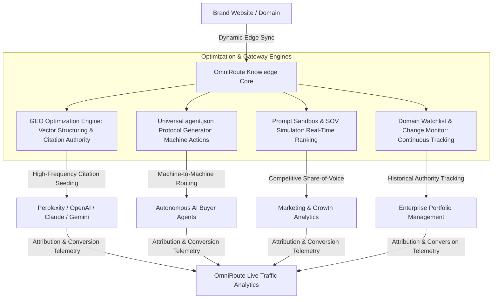

# OmniRoute Protocol — Master Project Documentation

> **Version:** 2.0.0  
> **Status:** Active / Production-Ready  
> **Mainnet Standard:** `v2.0-MAINNET`  
> **Repository Location:** `scratch/omniroute-app`  
> **Last Updated:** August 2026

---

## 1. Executive Summary & Vision

**OmniRoute** is the autonomous Generative Engine Optimization (GEO) and synthetic-to-human traffic routing protocol built for the post-search AI economy.

### The Macroeconomic Problem
* **The Zero-Click Shift:** AI answer engines (ChatGPT, Perplexity, Claude, Apple Intelligence) are cannibalizing traditional search clicks (>65% of queries now end without a blue-link click).
* **Ad Spend Inflation:** Paid acquisition CAC across Meta and Google has risen by 24%+ YoY due to tracking signal loss.
* **The Rise of Machine-to-Machine Intent:** By 2027+, over 40% of digital product discovery and commerce will be conducted by autonomous AI buyer agents operating on behalf of humans.

### OmniRoute’s Solution
OmniRoute creates an infrastructure bridge between digital properties and AI systems:
1. Optimizing semantic vector authority so brands are cited as primary sources by LLMs.
2. Publishing machine-readable `agent.json` gateway manifests for zero-friction autonomous purchases.
3. Providing real-time telemetry and cryptographic proof-of-human referral liquidity.
4. Enabling continuous domain watchlist tracking and shareable enterprise audit reporting.

---

## 2. Platform Architecture

---

## 3. Core Feature Inventory & Modules

### 📍 Module 1: Command Center (`/`)
* **Purpose:** Executive dashboard and real-time network health monitor.
* **Key Features:**
  * Global protocol status ticker (Active nodes, Mainnet status, Citation win-rates).
  * Quick-Scan Domain input bar with instant preset shortcuts (Stripe, Shopify, Linear, Notion, Vercel).
  * Core KPI metric cards with historical trends and equivalent ad spend savings.
  * Live streaming feed of incoming agent transactions and citations.
  * Interactive CAC & Agentic Yield Calculator.

### 📍 Module 2: GEO & AI Citation Scanner (`/audit`)
* **Purpose:** Live crawler & deep-dive diagnostics on domain visibility across generative engines.
* **Key Features:**
  * **Overall GEO Score (0–100):** Weighted multi-variable authority index.
  * **Live DOM Ingestion Strip:** Displays live page title, extracted JSON-LD schemas, heading hierarchy (`h1`, `h2`), word count, and table counts.
  * **Sub-indices:** Zero-Click Resilience, Information Gain, Entity Grounding, Vector Readiness.
  * **Engine Diagnostics:** Engine-by-engine analysis for Perplexity Pro, OpenAI GPT-4o Search, Claude 3.5 Web, and Google Gemini Grounding.
  * **Knowledge Graph Entity Detection:** Identifies semantic entities associated with the domain in LLM latent spaces.
  * **1-Click Targeted Protocol Patches:** Copyable code snippets for Schema.org, Dataset JSON-LD, Wikidata entity disambiguation, and m-HTML vector chunking.
  * **Enterprise Export & Watchlist Action:** 1-click "Export Report (PDF)" and "Save to Watchlist" integration.

### 📍 Module 3: Domain Watchlist & Score History (`/watchlist`)
* **Purpose:** Continuous tracking of brand and competitor domain portfolios.
* **Key Features:**
  * Persistent domain monitoring via local storage and state management.
  * Score delta tracking (highlights historical gain/loss in GEO authority).
  * Portfolio status indicators (`OPTIMAL`, `MODERATE`, `AT_RISK`).
  * 1-click jump to full diagnostic audit for any watched property.

### 📍 Module 4: Universal `agent.json` Protocol Studio (`/manifest`)
* **Purpose:** Standard builder and validator for machine-readable web manifests.
* **Key Features:**
  * **Visual Builder:** Interactive form to define domain identity, access policies, executable endpoints, and product catalogs.
  * **Specification Standard (`/.well-known/agent.json`):** Formats compliant JSON declarations.
  * **Cloudflare Workers / Edge Gateway Generator (`worker.js`):** 1-click serverless script to serve the manifest in under 5ms worldwide.
  * **Export:** Instant download of `agent.json`.

### 📍 Module 5: AI Prompt Citation Sandbox (`/simulator`)
* **Purpose:** Testing and simulating real-world prompt responses and share-of-voice.
* **Key Features:**
  * Foundation model selector (Perplexity, OpenAI, Claude, Gemini).
  * High-intent query tester with pre-loaded intent benchmarks (Comparison, How-to, Purchase, Research).
  * Simulated generative answer synthesis with hyperlinked footnote citations.
  * **Share-of-Voice (SOV) Meter:** Projected percentage of citation dominance.
  * Monthly referral visit and equivalent PPC value projection.

### 📍 Module 6: Traffic Liquidity & Conversion Analytics (`/analytics`)
* **Purpose:** Real-time cross-channel traffic telemetry and unit economics tracker.
* **Key Features:**
  * Traffic influx channel distribution breakdown (Perplexity, OpenAI, `agent.json` buyer bots, P2P human mesh).
  * Unit economics monitor: Effective Blended CAC ($4.18), Agent LTV ($1,240), Machine Conversion Rate (14.2%).
  * Live cryptographic event stream with pause/resume functionality.

---

## 4. API Endpoints Reference

| Route | Method | Description |
| :--- | :--- | :--- |
| `/api/v1/scan` | `POST` | Ingests `{ url: string }` and returns complete GEO audit report with live DOM signals. |
| `/api/v1/simulate` | `POST` | Ingests `{ domain, query, model }` and returns simulated LLM reasoning & citation rankings. |
| `/api/v1/manifest` | `GET` | Serves dynamic machine-readable `agent.json` schema for any domain. |

---

## 5. Living Changelog & Version History

| Version | Date | Key Enhancements |
| :--- | :--- | :--- |
| **v2.0.0** | Aug 2026 | **Phase 2 Operational Backend:** Live URL crawler API (`/api/v1/scan`), AI simulation API (`/api/v1/simulate`), dynamic manifest endpoint (`/api/v1/manifest`), Domain Watchlist Hub (`/watchlist`), API Keys configuration modal, and Branded PDF export. |
| **v1.1.0** | Aug 2026 | Non-sticky scrolling navbar, mobile hamburger drawer, responsive diagnostics & horizontal scroll protection. |
| **v1.0.0** | Aug 2026 | Initial Phase 1 release: Command Center, GEO Scanner, `agent.json` Studio, Prompt Sandbox, Traffic Analytics. |

---

*This document is continuously updated with every new feature, API revision, or architectural enhancement.*
