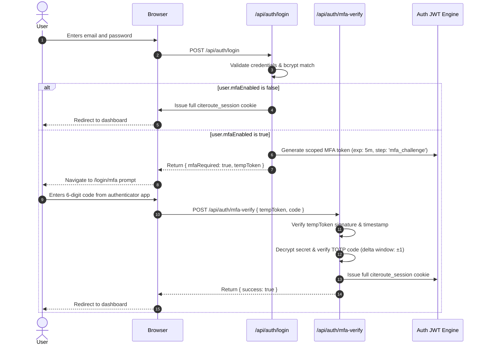

# Multi-Factor Authentication (MFA) Architectural Evaluation & Integration Roadmap

## Executive Summary

As CiteRoute expands its enterprise customer footprint, securing user accounts against credential stuffing, automated brute-force attacks, and password compromise is critical. While enforcing a strong password policy and common password blacklist eliminates predictable credentials, Multi-Factor Authentication (MFA) provides a defense-in-depth security barrier ensuring that even compromised credentials cannot yield unauthorized access.

This document outlines the architectural evaluation, protocol design, database considerations, and step-by-step roadmap for implementing MFA in CiteRoute.

---

## 1. Threat Model & Risk Assessment

| Attack Vector | Weak Password Impact | Impact with Strong Policy + Blacklist | Impact with MFA Enforced |
| :--- | :--- | :--- | :--- |
| **Credential Stuffing** | High (Immediate account takeover) | Moderate (Deterred if password was unique) | Negligible (Attacker lacks 2nd factor) |
| **Targeted Brute-Force** | High (Dictionaries crack weak passwords) | Low (Rate limiting + 128-char entropy) | Prevented (Requires physical authenticator device) |
| **Third-Party Breach Reuse** | Critical (Identical password breached elsewhere) | High (If user reuses complex password) | Prevented (Second factor remains uncompromised) |
| **Phishing / Keyloggers** | Critical (Plaintext capture yields full access) | Critical (Plaintext captured) | Mitigated (Time-based OTP expires in 30 seconds) |

---

## 2. Authentication Protocol Evaluation

### Option A: Time-based One-Time Password (TOTP, RFC 6238) — Recommended
- **Standard**: RFC 6238 / RFC 4226 (HMAC-SHA1, 30-second window, 6 digits).
- **Client Applications**: Google Authenticator, Microsoft Authenticator, 1Password, Bitwarden, Apple Keychain.
- **Advantages**:
  - Zero external delivery costs (no SMS or email vendor fees).
  - Works offline without cellular or network coverage.
  - Immune to SIM-swapping and email account compromise.
- **Enterprise Suitability**: High. Mandatory standard for modern SaaS platforms.

### Option B: Transactional Email OTP (Fallback / Complementary)
- **Standard**: 6-digit cryptographically random token dispatched via Resend transactional API with 10-minute expiry.
- **Advantages**: Zero client app installation required. Simple onboarding.
- **Limitations**: If an attacker compromises the user email account, they compromise both primary and second factors.
- **Recommendation**: Offer as secondary recovery mechanism or optional preference.

---

## 3. Database Schema Design (Zero-Downtime Migration)

To support MFA without impacting existing active sessions or schema invariants, the following additive fields are designated for the Prisma `User` model:

```prisma
model User {
  // Existing fields
  id                    String    @id @default(cuid())
  email                 String    @unique
  name                  String
  passwordHash          String?
  role                  String    @default("user")
  tier                  String    @default("free")

  // MFA Extension Fields
  mfaEnabled            Boolean   @default(false)
  mfaType               String    @default("totp") // totp | email
  mfaSecretEncrypted    String?   // AES-256-GCM encrypted base32 TOTP secret
  mfaBackupCodesHashed  String?   // JSON array of bcrypt-hashed single-use recovery codes
  mfaEnrolledAt         DateTime?
}
```

> [!NOTE]
> TOTP secrets must never be stored in plaintext. They should be encrypted using `AES-256-GCM` with a server-side encryption key derived from `MFA_ENCRYPTION_KEY` in environment secrets.

---

## 4. Authentication Pipeline & Session Flow



---

## 5. OAuth Exemption Rationale

Users authenticating via Google or GitHub OAuth (`provider: 'google' | 'github'`) already delegate authentication to identity providers with enterprise-grade MFA and passkey enforcement. 

- For OAuth sessions, local MFA is bypassed because Google and GitHub mandate their own multi-factor policies.
- Local MFA strictly targets standard email/password credentials where local password compromise presents an operational exposure.

---

## 6. Implementation Milestones

1. **Phase 1: Core Policy & Blacklist Enforcement (Completed)**
   - Enforce 8+ character minimum with uppercase, lowercase, numeric, and symbol diversity.
   - Reject high-risk common password patterns and breached dictionaries.
   - Interactive client feedback and strength metering.
2. **Phase 2: TOTP Secret Generation & Enrollment UI**
   - Provide QR code generator and manual key input in user security settings (`/dashboard/settings/security`).
   - Require verification of first TOTP code before activating `mfaEnabled: true`.
   - Generate and display 8 single-use emergency backup recovery codes.
3. **Phase 3: Login Challenge Interceptor**
   - Implement `/login/mfa` challenge view and temporary challenge token verification endpoint.
   - Implement rate limiting on MFA challenge endpoint (max 5 attempts per 5 minutes per IP to prevent OTP brute-forcing).
